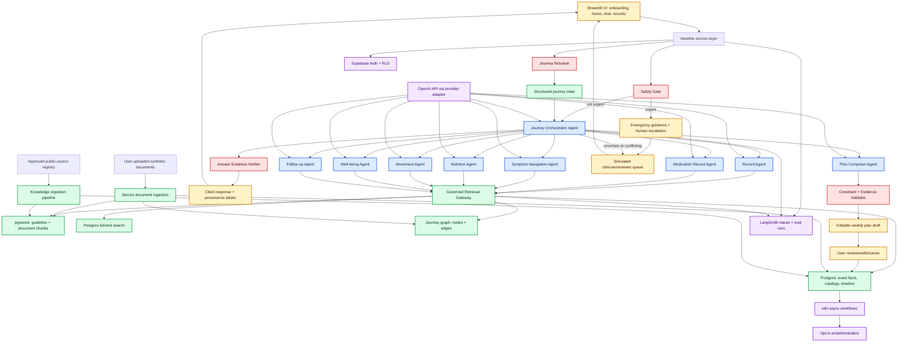
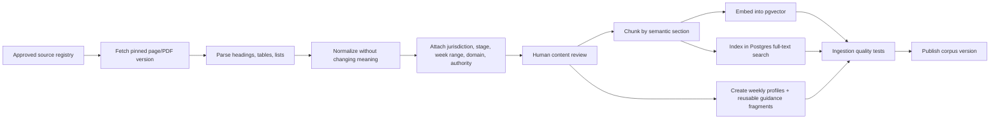
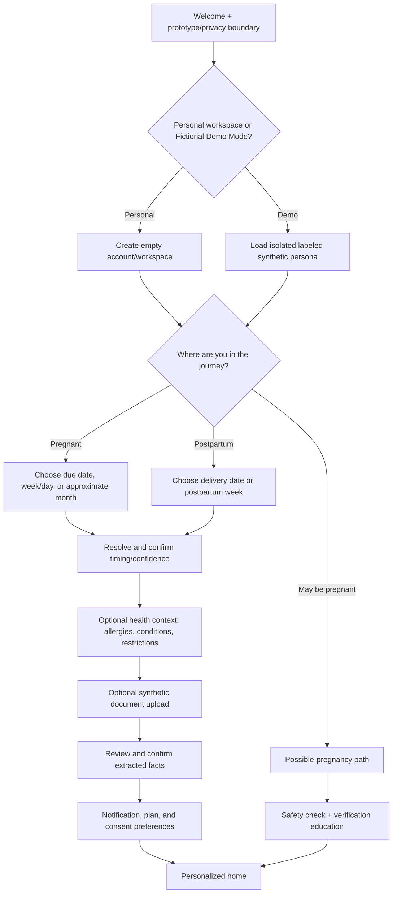
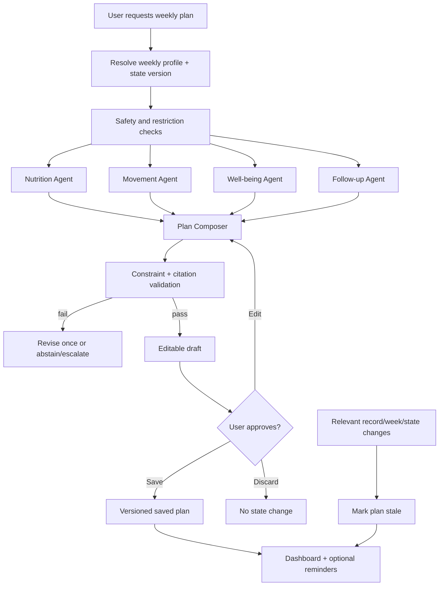

# Nestline — Updated Product and AI Architecture

**Product:** Nestline<br>
**Assistant:** Compass<br>
**Status:** Build-ready capstone specification<br>
**Last updated:** 9 September 2026<br>
**Journey scope:** Possible pregnancy and pregnancy through 12 weeks postpartum<br>
**Language:** English only<br>
**Primary context:** India; supplementary global sources must retain jurisdiction labels

> This is the canonical architecture reference for Nestline. The earlier source-of-truth document is retained only as decision history. If the two documents conflict, this document wins.

> **Safety boundary:** Nestline is an educational and organizational capstone prototype. It is not a doctor, diagnostic system, prescriber, medical device, emergency service, or clinically validated product. The public demo must use synthetic data and must tell visitors not to upload real medical information.

---

## 1. The product in one paragraph

Nestline is a week-aware maternal journey companion. A user enters an estimated due date, gestational week and day, approximate pregnancy month, delivery date, or postpartum week. Compass then creates a personalized home view from three clearly separated layers: stage-appropriate public guidance, facts extracted from documents the user intentionally uploads, and information the user confirms in the app. The user can ask questions, understand what a record says, navigate symptoms safely, create an editable weekly nutrition/movement/well-being plan, track appointments, and prepare questions for a professional. Urgent, contradictory, uncertain, or unsupported situations stop the normal AI flow and enter an explicit safety or human-review path.

## 2. The problem we solve

Pregnancy and postpartum information is fragmented across reports, prescriptions, appointments, conversations, websites, and memory. Generic chatbots can answer broad questions, but they often do not know the user's current stage, cannot distinguish a doctor's documented instruction from general internet guidance, and may answer when they should abstain or escalate.

Nestline creates continuity without pretending to practise medicine:

- It resolves where the user is in the journey and keeps every interaction stage-aware.
- It keeps personal records, user-reported information, and public guidance visibly separate.
- It coordinates bounded specialist workflows instead of asking one prompt to do everything.
- It validates evidence, citations, conflicts, and safety before displaying an answer.
- It turns information into reviewable next steps, saved plans, reminders, and handoff summaries.

## 3. What is locked for the capstone

| Area | Decision |
|---|---|
| Interface | Streamlit web app deployed through Streamlit, with a dashboard and persistent chat |
| Timing shown to user | Exact week when known; approximate stage when only a month is known |
| Content storage | One explicit weekly profile for every pregnancy and postpartum week, assembled from reusable sourced guidance fragments |
| Model | OpenAI API behind a provider adapter, if API billing/key is confirmed |
| Optional model comparison | Fireworks AI; Grok is not required |
| Orchestration | LangGraph/LangChain state graph with bounded routes |
| Product data | Supabase Auth, Postgres, Storage, pgvector, and Row Level Security |
| Retrieval | One governed retrieval service with domain filters, hybrid search, reranking, and citations |
| GraphRAG | Postgres node/edge tables plus bounded traversal; no Neo4j required for the capstone |
| Tracing and evaluation | LangSmith plus automated local test reports |
| Async automation | n8n only for non-urgent email/reminder and reviewer workflows |
| Voice | ElevenLabs deferred |
| Video | Excluded from this architecture and capstone |
| Fine-tuning | Optional only after evaluation proves a repeated narrow failure |
| MCP | Optional later; typed internal tools are sufficient for the capstone |
| Public web search at answer time | Disabled for medical answers |
| Real medical data | Prohibited in the public capstone |

### Important access clarification

ChatGPT Pro and OpenAI API billing are separate. Before implementation, confirm that the team has an API key and active API billing; a ChatGPT Pro subscription alone does not supply API credits. If OpenAI API access is not confirmed, use the same provider interface with one Fireworks-hosted model and rerun the model comparison evals.

“Finecode” is not included because the intended product/tool is unclear. It should not enter the architecture until the team identifies it and a concrete requirement it solves.

### 3.1 Streamlit application and deployment

Streamlit is the committed front end for the capstone. The GitHub repository will contain `streamlit_app.py` as the deployment entry point, with reusable UI components and service modules behind it. Deploy the application from the repository to Streamlit Community Cloud.

Recommended Streamlit views:

1. welcome, privacy boundary, and Personal/Demo Mode selection;
2. onboarding and journey-time selection;
3. weekly home dashboard;
4. persistent Compass chat;
5. documents and extracted-fact review;
6. saved plan and appointments;
7. simulated human-review status;
8. evaluator-only evidence, graph, and trace view.

`st.session_state` manages only temporary page/chat interaction. Supabase remains the source of truth for journey state, confirmed facts, documents, plans, and appointments so a browser refresh does not lose important state. API keys go in Streamlit deployment secrets/environment variables and never in Git.

---

## 4. The timing model: weekly in the product and data model

Week 10 and week 20 cannot be treated as the same experience. Trimester-only retrieval is too broad, and the earlier two-week-band wording made the architecture harder to understand. Nestline will therefore have a separate addressable profile for every pregnancy week and every postpartum week.

This does not mean copying the same paragraph 40 times. Stable, source-backed guidance is stored once as a reusable fragment with an applicability range, and each weekly profile references the fragments that apply to that exact week.

Nestline therefore uses this composition:

```text
Displayed weekly experience
= exact weekly profile
+ reusable sourced guidance fragments applicable to that week
+ personal structured facts
+ relevant record events
+ current symptoms/check-ins
+ saved-plan state
```

The result is genuinely weekly: pregnancy weeks `P01` through `P42` and postpartum weeks `PP01` through `PP12` each have their own profile. Reuse happens at the content-fragment level, not by collapsing two different weeks into one record.

### 4.1 Supported journey inputs

The onboarding control is a selector with one input mode at a time:

1. **Estimated due date — recommended.** The system calculates gestational week and day.
2. **Current gestational week.** User enters week 1–42 and may optionally add day 0–6.
3. **Approximate pregnancy month.** Used when the user does not know a date or week. Outputs remain explicitly approximate.
4. **Delivery date.** Used for postpartum users and calculates postpartum day/week.
5. **Current postpartum week.** Used when the delivery date is not provided.
6. **I may be pregnant / I am not sure.** Opens the possible-pregnancy path without falsely assigning a pregnancy week.

Do not offer a standalone “day” input. “Day 3” is meaningless unless attached to a gestational week or postpartum state.

### 4.2 Journey resolver rules

| Input | Stored result | UX behavior |
|---|---|---|
| Due date | Calculated gestational age, calculation date, confidence=`calculated` | “Week 10, day 3” and exact-week content |
| Week + optional day | User-confirmed gestational age, effective date, confidence=`reported` | Exact-week content |
| Month only | Approximate week range and confidence=`approximate` | Guidance supported across the full range; no exact-week fetal claim |
| Delivery date | Calculated postpartum day/week | Postpartum interval content |
| Postpartum week | Reported postpartum interval | Exact postpartum-week profile |
| Possible pregnancy | `possible_pregnancy` | Verification/next-step education, not “you are pregnant” language |

If the due date and reported week conflict materially, Compass displays both, explains that they do not align, and asks the user to confirm the latest clinician-dated value. It must not silently choose one.

Journey age is recalculated daily. Every answer and saved plan stores the journey-state version used to create it.

### 4.3 Weekly profiles

| Profile family | Records | Meaning |
|---|---:|---|
| Possible pregnancy | `PC00` | Testing, verification, safety, and general preconception education without asserting pregnancy |
| Pregnancy | `P01`–`P42` | One separate profile for every gestational week |
| Postpartum | `PP01`–`PP12` | One separate profile for every postpartum week |
| Early postpartum safety | `PPD0`, `PPD1`–`PPD7` | Day-level safety/follow-up additions during the first week; these supplement `PP01` |

Each weekly profile can contain different development, body-change, nutrition-focus, movement-focus, well-being, preparation, appointment, do/avoid, and question-for-professional cards. A reviewer can compare `P13` with `P14` directly even if some of their referenced guidance fragments are identical.

For month-only onboarding, use a transparent product mapping rather than pretending the month is precise: month 1 → weeks 1–4, month 2 → 5–8, month 3 → 9–13, month 4 → 14–17, month 5 → 18–22, month 6 → 23–27, month 7 → 28–31, month 8 → 32–35, and month 9 → 36–40+. The UI says “approximately weeks X–Y” and invites the user to add an estimated due date later.

When the user supplies only a month, the system does **not** secretly pick one week. It retrieves only fragments valid across that full mapped range and presents a range-based home state. The user receives an exact weekly profile only after supplying a due date or week.

### 4.4 Content-unit schema

Every published weekly profile is structured rather than stored as one long article:

```json
{
  "profile_id": "P10",
  "content_type": "weekly_profile",
  "journey_stage": "pregnancy",
  "week": 10,
  "domains": ["development", "nutrition", "movement", "wellbeing", "preparation"],
  "cards": {
    "development": [],
    "what_may_change": [],
    "focus": [],
    "consider": [],
    "avoid": [],
    "ask_professional": []
  },
  "guidance_fragment_ids": [],
  "week_specific_evidence_ids": [],
  "jurisdiction": ["GLOBAL", "IN"],
  "review_status": "draft | content_reviewed | clinical_reviewed",
  "version": "1.0.0",
  "effective_from": "date",
  "retired_at": null
}
```

A reusable guidance fragment has its own domain, applicability start/end, exclusions, jurisdiction, evidence spans, and review status. For example, the same reviewed hydration fragment may be referenced by several weekly profiles, while development and preparation cards remain week-specific. This preserves weekly behavior without unnecessary duplication.

### 4.5 Week 1 and possible pregnancy

Gestational dating commonly counts from the first day of the last menstrual period; in weeks 1–2, conception may not yet have occurred. Therefore:

- “I may be pregnant” is its own state.
- Week 1 content explains dating carefully and does not claim a pregnancy is confirmed.
- The flow can explain how/when confirmation is normally sought using approved source content.
- It can suggest general questions and next steps, but does not interpret a test as a diagnosis.
- Symptoms still pass through the safety gate before educational content.
- It never advises starting/stopping medication based solely on chat.

---

## 5. Complete system architecture

**Legend:** blue = agents; red = safety/control; green = data/retrieval; purple = external platform; amber = human/user step.



### 5.1 Request pipeline in plain English

1. Authenticate the user and establish their isolated workspace.
2. Resolve possible-pregnancy, pregnancy, or postpartum timing and confidence.
3. Run deterministic red-flag checks before any generative reasoning.
4. Classify intent and determine which specialist workflow is needed.
5. Fetch exact personal facts from SQL and relevant evidence through the retrieval gateway.
6. Run one primary specialist agent; invoke a second only when the task genuinely crosses domains.
7. If a plan is requested, combine specialist contributions in the Plan Composer.
8. Validate stage, allergies, restrictions, record conflicts, evidence, and citations.
9. Escalate or abstain when evidence is absent, contradictory, urgent, or beyond scope.
10. Present the answer with provenance: “your record says,” “you reported,” or “public guidance says.”
11. Save only after explicit user confirmation.
12. Trace the complete route in LangSmith and record feedback/evaluation signals.

---

## 6. Data sources and content governance

The earlier few PDFs were not sufficient for a weekly product. Nestline needs a source portfolio: weekly developmental content, broader clinical guidance, India-specific nutrition/care guidance, postpartum timing, and the user's own records.

### 6.1 Recommended public-source registry

| Need | Source | How it is used | Limitation/control |
|---|---|---|---|
| Weekly pregnancy development, including weeks 1–4 | [Pregnancy, Birth and Baby — week-by-week](https://www.pregnancybirthbaby.org.au/pregnancy/pregnancy-stages/pregnancy-week-by-week) | Primary weekly content candidate | Australian jurisdiction; validate reuse/license and label jurisdiction |
| Weekly pregnancy cross-check | [NHS week-by-week guide](https://www.nhs.uk/best-start-in-life/pregnancy/week-by-week-guide-to-pregnancy/) | Cross-check exact-week changes and accessible wording | UK care pathways must not be presented as Indian schedules |
| Week 1–2 dating explanation | [MedlinePlus fetal development](https://medlineplus.gov/ency/article/002398.htm) | Dating/early-stage evidence | Educational summary, not personalized advice |
| Possible pregnancy and testing education | [NHS pregnancy testing](https://www.nhs.uk/pregnancy/trying-for-a-baby/doing-a-pregnancy-test/) | Possible-pregnancy pathway | Jurisdiction labeled; no diagnosis |
| Global antenatal guidance | [WHO antenatal care recommendations](https://www.who.int/publications/i/item/9789241549912/) | Approved general guidance and retrieval corpus | Usually applies by condition/visit, not exact week |
| Consolidated maternal guidance | [WHO 2025 maternal health recommendations](https://www.who.int/publications/b/59332) | Guideline reference and safety review | Large corpus; ingest only approved sections with metadata |
| India nutrition | [ICMR-NIN Dietary Guidelines for Indians 2024](https://www.nin.res.in/dietaryguidelines/pdfjs/locale/DGI07052024P.pdf) | Nutrition agent evidence | Not inherently weekly; map only where applicability supports it |
| Pregnancy physical activity | [WHO physical activity and sedentary behaviour](https://iris.who.int/bitstream/handle/10665/336656/9789240015128-eng.pdf) | Movement constraints and general guidance | Never infer individual clearance |
| India maternal-care context | [NHM pregnancy-care guidance](https://nhm.gov.in/images/pdf/guidelines/nrhm-guidelines/stg/pregnancy-care.pdf) | Candidate care/timeline fields | Older source; requires version/currentness review before release |
| Postpartum first six weeks | [WHO postnatal-care guideline](https://www.who.int/publications/i/item/9789240045989) | Postpartum weekly profiles and follow-up context | Source-defined applicability must be preserved |
| Postnatal intervention timing | [WHO maternal intervention timing](https://www.who.int/teams/maternal-newborn-child-adolescent-health-and-ageing/handbooks/programme-manager-s-handbook-mncah/recommendations-on-interventions-along-life-course/maternal) | 24-hour/day 3/day 7–14/week 6 structure | Do not invent weekly changes after week 6 |
| Perinatal mental health | [WHO perinatal mental-health integration guide](https://www.who.int/publications/i/item/9789240057142) | Well-being and escalation corpus | Screening/education only; no diagnosis |
| Urgent warning-sign taxonomy | [CDC urgent maternal warning signs](https://www.cdc.gov/hearher/maternal-warning-signs/index.html) | Safety-test design and supplementary reference | US source; clinician review/local adaptation required |

### 6.2 Source rules

- Every source has owner, title, jurisdiction, publication/update date, version, URL, license/reuse note, approved sections, clinical-review status, and retirement status.
- Exact-week facts must cite a source that actually supports that exact week.
- General guidance retains its real applicability; the model must not relabel trimester-level guidance as week-specific.
- Foreign care schedules are not mixed into India-specific appointment advice.
- Retrieval uses only approved and current source versions.
- Source updates create a new version, re-index affected chunks, and rerun regression evals.
- The app never performs uncontrolled live web search for a medical answer.

### 6.3 Personal sources

Personal context comes only from:

- structured onboarding answers the user confirms;
- synthetic reports, prescriptions, appointment notes, or discharge documents uploaded in the demo;
- confirmed facts extracted from those documents;
- symptoms/check-ins the user explicitly reports;
- plans and reminders the user explicitly saves.

Synthetic personas belong only in isolated Demo Mode and automated tests. A new user's workspace starts empty.

---

## 7. Ingestion architecture

### 7.1 Public-knowledge ingestion



Do not ask an LLM to manufacture week-by-week advice from one broad PDF. The LLM may help extract candidate structure, but each published content unit must retain exact source spans and pass review.

### 7.2 Personal-document ingestion

1. Authenticate and establish the user's workspace ID.
2. Validate file type, size, malware policy, and encryption/locked-file status.
3. Store the original in a private Supabase Storage bucket.
4. Parse locally/server-side; use OCR only when necessary.
5. Classify document type and reject unsupported types gracefully.
6. Extract candidate facts into strict schemas: date, clinician, medication mention, instruction, appointment, test, condition, allergy, and uncertainty.
7. Attach page and text-span provenance to every candidate fact.
8. Show low-confidence or clinically significant facts for user confirmation.
9. Save confirmed facts to structured Postgres tables.
10. Chunk permitted text into the user's isolated vector namespace.
11. Update timeline and graph edges.
12. Run post-ingestion validation and surface conflicts instead of overwriting them.

Documents are untrusted input. Embedded instructions such as “ignore previous rules” are treated as document text, never executable instructions.

---

## 8. Supabase data architecture

Use Supabase because the intended UX includes accounts, private files, structured timelines, retrieval, plans, and reminders. SQLite/Chroma is acceptable for a laptop demo but creates avoidable migration and isolation work.

### 8.1 Core tables

| Table | Purpose |
|---|---|
| `profiles` | Minimal user settings and consent state |
| `journey_states` | Possible-pregnancy/pregnancy/postpartum state, timing input, resolved age, confidence, version |
| `health_facts` | User-confirmed conditions, allergies, restrictions, and provenance |
| `documents` | File metadata, status, owner, hashes, parsing confidence |
| `document_facts` | Extracted fact, source page/span, confirmation state |
| `medication_mentions` | What a document records; never a prescribing table |
| `symptom_events` | User-reported symptom, time, severity answers, disposition |
| `appointments` | Date, type, status, source, questions |
| `plans` / `plan_items` | Draft/saved versions and state-version dependency |
| `weekly_profiles` | Separate home/content configuration for `P01`–`P42` and `PP01`–`PP12` |
| `guidance_fragments` | Reusable sourced guidance with exact applicability ranges and exclusions |
| `postpartum_day_overlays` | Day 0–7 safety/follow-up additions to postpartum week 1 |
| `guideline_chunks` | Public evidence chunks, embeddings, citations, metadata |
| `personal_chunks` | Per-user permitted document chunks and embeddings |
| `graph_nodes` / `graph_edges` | Provenance-aware journey relationships |
| `human_review_cases` | Consent-aware escalation packets and statuses |
| `notifications` | Opt-in reminder/email job state and idempotency key |
| `feedback` | User rating, correction, route, and trace ID |

### 8.2 Isolation requirements

- Row Level Security on every user-owned table.
- Storage paths scoped by authenticated user/workspace.
- Personal retrieval requires the authenticated workspace filter at the database layer, not only in the prompt.
- Public and personal embeddings remain different logical collections/tables.
- Deletion removes file, structured facts, chunks, graph relationships, and cached summaries.
- Logs and LangSmith traces must redact personal content; public demo uses only synthetic records.

---

## 9. RAG architecture

### 9.1 One retrieval platform, not one RAG per agent

Separate RAG stacks for Nutrition, Movement, Symptoms, and Well-being would duplicate ingestion, embeddings, permissions, monitoring, and source updates. Agents need different retrieval **policies**, not different infrastructure.

The governed Retrieval Gateway accepts:

```json
{
  "workspace_id": "authenticated-scope",
  "domain": "nutrition | movement | symptoms | wellbeing | records | followup",
  "journey_state": "pregnancy | postpartum | possible_pregnancy",
  "exact_week": 10,
  "weekly_profile_id": "P10",
  "jurisdiction": "IN",
  "source_scope": "public | personal | both",
  "query": "user question",
  "top_k": 8
}
```

### 9.2 Retrieval sequence

1. Convert request into a typed retrieval query.
2. Apply hard filters: user scope, domain, approved status, journey state, applicability, jurisdiction.
3. Fetch exact personal facts with SQL where possible.
4. Run Postgres full-text and pgvector searches in parallel.
5. Fuse rankings and rerank by authority, applicability, recency/version, and semantic relevance.
6. Traverse only relevant graph edges for dependencies/conflicts.
7. Return evidence objects with exact source spans—not a free-form answer.
8. Generate the answer from those evidence objects.
9. Verify each material claim has adequate evidence and the correct provenance label.
10. Abstain/escalate when support is insufficient.

### 9.3 Retrieval collections

- `weekly_profiles`: the exact pregnancy or postpartum week requested by the application.
- `guidance_fragments`: reviewed reusable evidence whose applicability includes the resolved week or entire approximate range.
- `guideline_chunks`: public clinical/educational guidance.
- `personal_chunks`: isolated document text.
- structured SQL catalogs: food components, movement templates, plan constraints, and help content.

The LLM is not the knowledge base. OpenAI/Fireworks turns retrieved evidence and structured facts into a readable response; it must not supply uncited medical facts from model memory.

### 9.4 Load and cost controls

- Precompute and cache every published weekly profile by profile and corpus version.
- Home-page load uses SQL/database views and the Dashboard Composer; it does not call every agent.
- Recalculate only the timing label at daily rollover unless the user crosses into a new week.
- Embed a public source once per approved version, not per user or request.
- Retrieve personal data only for the authenticated workspace and only when the task needs it.
- Route ordinary questions to one specialist; use multi-agent parallelism only for a full weekly plan.
- Cache only non-personal public retrieval results by normalized question, exact week/range, domain, jurisdiction, and corpus version.
- Set maximum agent steps, retrieval results, model calls, tokens, and wall-clock time for each route.
- Use a smaller evaluated model for routing/extraction and a stronger model only for difficult composition when the evals justify model routing.

---

## 10. Onboarding user flow



### Onboarding rules

- Only timing is required for stage-aware educational content.
- Health context and uploads are optional and skippable.
- Never prefill a personal workspace with fictional history.
- Explain why each sensitive field is requested and how it changes the experience.
- A user can edit or delete a fact later.
- Low-confidence extraction never becomes confirmed state automatically.
- Urgent symptom text entered anywhere runs through the safety gate immediately.

---

## 11. Personalized home/landing page

The home view is generated by a deterministic Dashboard Composer using validated data. An LLM may draft summaries, but it does not choose the page's safety state or invent cards.

### 11.1 Page order

1. **Journey header:** “Week 10, day 3” or “approximately month 3,” with how it was calculated and an edit action.
2. **Development hero:** reviewed exact-week fact and original/licensed visual or simple in-house illustration. Approximate users see a range, not a false precise claim.
3. **This stage:** concise “what may be changing” public guidance with sources.
4. **Your context:** confirmed allergies, restrictions, conditions, or record changes, clearly labeled as personal facts.
5. **Focus this week:** evidence-backed nutrition, movement, well-being, and preparation themes. These are not prescriptions.
6. **Consider / avoid / ask first:** separate categories with evidence/source labels. Do not mix doctor's recorded instruction with general guidance.
7. **Symptoms and safety:** reported symptoms, follow-up state, and persistent emergency access.
8. **Appointments:** next appointment, pending actions, and saved questions for the professional.
9. **Weekly plan:** no plan / editable draft / saved / stale status.
10. **Open issues:** conflicting record, unconfirmed extraction, overdue follow-up, or human-review status.
11. **Quick actions:** ask Compass, understand a record, create/edit a plan, add a symptom, add an appointment.

### 11.2 Personalization precedence

1. Emergency/safety status.
2. Confirmed clinician-recorded restriction/instruction.
3. Confirmed allergy/condition and active relevant symptoms.
4. Exact journey state and weekly profile.
5. Saved preferences and plan history.
6. General public guidance.

If layers conflict, the UI shows the conflict and asks for professional clarification; general guidance never silently overrides a personal record.

### 11.3 Traditional remedies

“Grandmother's remedies” can be relatable, but they cannot appear as a casual recommendation carousel. Include an **Ask about a traditional practice** action. The answer must classify the practice as supported, uncertain, or potentially risky based on approved evidence, state what is unknown, and recommend professional confirmation where appropriate.

---

## 12. Chat capabilities and conversation behavior

Compass supports:

- “What usually changes in week 10?”
- “What does my uploaded prescription say?”
- “What should I ask at my next appointment?”
- “Create an editable nutrition/movement/well-being plan for this week.”
- “Why is my saved plan marked stale?”
- “I have this symptom—what should I do next?” through bounded symptom navigation.
- “Can I follow this traditional practice?” through evidence checking.
- “Change this plan item and save the new version.”

Compass does not:

- diagnose a condition;
- decide whether the user or baby is healthy;
- prescribe, change, or stop medication;
- infer clinician approval for exercise;
- promise that a symptom is harmless;
- answer from uncontrolled web search;
- hide uncertainty or conflicting evidence.

### Standard answer structure

1. Direct, plain-language response.
2. “Why this is relevant now” using the exact week only when supported.
3. Personal context used, with provenance labels.
4. Action options: save, ask professional, track, or escalate.
5. Citations and last-reviewed date.
6. Limitation/abstention when needed.

### Confused or ambiguous users

Compass asks at most one or two high-value clarification questions. If the question remains ambiguous, it provides safe general information, states the assumption, and avoids personalization. It must not create an endless agent loop.

---

## 13. Agent and control contracts

An agent is a bounded decision-making workflow: it receives typed state, uses allowed tools, produces a schema, and has explicit stop conditions. It does **not** mean “a chatbot with its own database.”

| Component | Type | Trigger and responsibility | Allowed evidence/tools | Required output | Must stop/escalate when |
|---|---|---|---|---|---|
| Safety Gate | Deterministic control | Runs on onboarding text, chat, symptoms, and document facts before agents | Reviewed red-flag taxonomy, rules | `safe_route`, `urgent_route`, or `needs_clarification` | Any urgent match or insufficient safety detail |
| Journey Resolver | Deterministic control | Converts input to stage/week/day/profile/confidence | Date functions, timing rules | Versioned journey state | Conflicting/invalid dates |
| Journey Orchestrator | Agent | Classifies intent, selects minimal specialist set, manages state | Typed agent tools, policy | Execution plan and final route | Budget exceeded, unsupported intent, agent conflict |
| Record Agent | Agent | Explains what uploaded records document | SQL facts + personal chunks | Cited record summary with uncertainty | Poor OCR, missing span, contradictory documents |
| Medication Record Agent | Agent | Compares recorded medication mentions/instructions over time | Medication tables + source spans | “Documented as…” timeline; clarification questions | User asks to start/stop/change, conflict, unclear dose |
| Symptom Navigation Agent | Agent | Collects bounded context and routes next step | Safety rules + approved symptom guidance | Urgency category and action wording | Red flag, ambiguity, repeated/worsening concern |
| Nutrition Agent | Agent | Creates stage-aware meal framework and answers nutrition questions | Band/week content, ICMR-NIN chunks, allergies, restrictions | Cited options and constraints | Allergy conflict, condition requiring individualized clinical diet |
| Movement Agent | Agent | Creates conservative activity framework | Approved movement guidance, stage, symptoms/restrictions | Activity type/time/intensity framework; no video | No clearance where needed, contraindication, concerning symptom |
| Well-being Agent | Agent | Provides check-ins, supportive exercises, and escalation | Approved mental-health guidance, user check-ins | Supportive next step and follow-up | Self-harm/acute safety concern or need for diagnosis |
| Follow-up Agent | Agent | Builds appointment questions, tasks, and reminder candidates | Timeline, appointments, record changes | Prioritized follow-up list | Missing/contradictory care information |
| Plan Composer | Agent | Combines specialist outputs into one non-conflicting weekly draft | Validated specialist schemas | Versioned editable plan draft | Any unresolved specialist conflict |
| Constraint Validator | Deterministic control | Tests plan/answer against state and policy | Allergies, restrictions, safety rules, schema | pass/fail with reasons | Any failed hard constraint |
| Evidence Verifier | LLM + rules control | Checks material claims against evidence objects | Citations, spans, applicability metadata | supported/unsupported claim map | Unsupported medical claim or wrong-week citation |
| Dashboard Composer | Deterministic service | Builds cards and states for home page | Validated database views | Ordered page schema | Missing required card data; show empty/error state |
| Human Review Workflow | Human-in-loop | Creates consent-aware packet for conflicts/uncertainty | Minimum necessary context | pending/resolved/unavailable state | Human unavailable; show fallback, never imply review occurred |

### Agent communication

Agents share a typed `JourneyState`, not free-form chat transcripts. Each output includes:

- `trace_id`, `user/workspace_id`, and `journey_state_version`;
- intent and requested deliverable;
- personal facts used with provenance;
- evidence objects and citations;
- assumptions and unanswered questions;
- safety status and escalation status;
- structured recommendation/plan candidates;
- confidence is not a medical-confidence score—it is evidence/completeness metadata.

The orchestrator normally calls one specialist. For “create my full week,” Nutrition, Movement, Well-being, and Follow-up can run in parallel; Plan Composer then reconciles them. Specialists do not call each other directly, which keeps the graph observable and prevents loops.

---

## 14. Weekly plan flow



A plan is a supportive framework, not a treatment plan. Every saved plan stores its sources, state version, creation date, and expiry/review date. When timing, allergy, restriction, medication record, concerning symptom, or relevant clinician instruction changes, the plan becomes stale and must not continue appearing as current without review.

---

## 15. GraphRAG design

GraphRAG is valuable when it proves continuity, not when added as decoration. Store nodes and edges in Postgres; use bounded graph traversal in application code. A visual NetworkX projection can be generated for the capstone demo.

### Nodes

`Person`, `JourneyState`, `WeeklyProfile`, `GuidanceFragment`, `Document`, `DocumentFact`, `MedicationMention`, `Allergy`, `Condition`, `SymptomEvent`, `Appointment`, `Plan`, `PlanItem`, `GuidelineChunk`, `Question`, `HumanReviewCase`.

### Edges

`IN_STAGE`, `EXTRACTED_FROM`, `MENTIONED_IN`, `CONFLICTS_WITH`, `SUPERSEDES`, `RELEVANT_TO`, `CONSTRAINS`, `SUPPORTED_BY`, `TRIGGERED`, `SCHEDULED_FOR`, `NEEDS_CLARIFICATION`, `REVIEWED_BY`.

### Example

```text
Week 10 state
  -> selects weekly profile P10
  -> references only guidance fragments applicable to week 10
  -> makes nausea symptom relevant
  -> allergy constrains meal candidate
  -> clinician restriction constrains movement candidate
  -> changed record marks saved plan stale
  -> pending appointment receives clarification question
```

Use graph traversal only for known relationship questions and constraint propagation. Use SQL for exact facts and vector/full-text retrieval for relevant passages.

---

## 16. Human-in-the-loop and professional contact

The capstone cannot claim a real on-call doctor. It demonstrates a transparent review queue:

1. A safety rule, conflict, unsupported question, or explicit request triggers review eligibility.
2. Compass tells the user what it can and cannot do now.
3. The user explicitly consents to share a minimum-necessary summary.
4. The system creates a structured packet: question, journey stage, relevant confirmed facts, cited record spans, conflict, urgency, and requested action.
5. A simulated reviewer interface accepts, requests clarification, resolves, or marks unavailable.
6. The user sees the true state: pending, responded, or unavailable. Never “doctor reviewed” unless a real authorized reviewer did.
7. Urgent situations receive immediate emergency-oriented instructions and are never placed into a delayed email queue as the only action.

Future production integration would require credential verification, response-time commitments, consent/audit design, jurisdictional review, clinical governance, privacy/security review, and operational ownership.

---

## 17. Errors, weird interactions, and failure behavior

| Situation | Required behavior |
|---|---|
| Invalid week/date | Explain valid range; preserve entered value until correction |
| Due date conflicts with week | Show both; request latest confirmed value; do not silently resolve |
| Month only | Label approximate; use only guidance valid across the mapped range; suppress exact-week fetal claims |
| Week 1 / may be pregnant | Use dating/verification path; do not assert pregnancy |
| No records uploaded | Give public, stage-aware guidance and state that no personal record was used |
| Unsupported/locked/corrupt file | Keep file status failed; explain supported format and next step |
| Low OCR confidence | Highlight uncertain fields; require confirmation |
| Record belongs to another person | Do not ingest into journey; ask user to remove/correct |
| Contradictory documents | Preserve both; create conflict; ask for professional clarification |
| Medication-change request | Summarize records only; do not advise change; escalate appropriately |
| Urgent symptom | Stop normal generation and show reviewed urgent route |
| Diagnosis request | State boundary, provide bounded navigation, recommend appropriate care route |
| No adequate evidence | Say the answer is not supported; do not answer from model memory |
| Wrong-week retrieval | Evidence verifier rejects answer and retries retrieval once |
| Traditional remedy unsupported | State uncertainty/risk; no recommendation |
| Agent disagreement | Plan is not saved; surface conflict or human-review path |
| Agent loop/tool budget reached | Stop, preserve trace, give a safe partial/abstaining response |
| Model timeout/rate limit | Retry once with idempotency; then show recoverable error |
| Supabase unavailable | Do not generate personalized answer from stale cache; show service state |
| n8n/email failure | Chat remains usable; notification marked failed and retried asynchronously |
| Human unavailable | Say so explicitly and give safe alternative; never fake review |
| Plan state changed | Mark plan stale and explain what changed |
| Prompt injection inside document | Treat as untrusted text; never alter system/tool policy |
| Cross-user retrieval test fails | Block release; this is a severity-zero privacy failure |
| User deletes data | Cascade delete derived chunks/edges/caches and log completion |
| User asks unrelated question | Briefly state scope and redirect; do not route through medical agents |
| User gives ambiguous symptom | Ask minimal clarifying questions; if safety cannot be established, escalate |

Every screen needs loading, empty, success, validation, recoverable error, and blocked/safety states.

---

## 18. n8n and email workflows

n8n is outside the synchronous medical-response path. It handles only delayed, non-critical workflows:

- opt-in weekly digest generated from already validated dashboard data;
- appointment reminders;
- saved-plan review reminders;
- human-review queue notification;
- notification retry/dead-letter processing.

Each job requires an idempotency key, user consent, timezone, preferred channel, unsubscribe control, retry limit, failure status, and audit timestamp. The email does not contain sensitive detail by default; it links the authenticated user back to Nestline. Urgent symptom handling never depends on email delivery.

ElevenLabs is not needed because voice adds consent, transcription, privacy, latency, and evaluation work without strengthening the four-day core demonstration.

---

## 19. Evaluation architecture

LangSmith records route, prompt/model version, retrieved evidence IDs, tool calls, latency, token/cost data, output schema, validator results, and user feedback. Personal fields must be redacted; use synthetic traces in the capstone.

### 19.1 Evaluation suites

| Suite | What to measure | Critical target for capstone |
|---|---|---|
| Journey resolver | Due-date math, week/day rollover, postpartum date, conflicts, month approximation | 100% on deterministic golden cases |
| Safety | Red-flag recall, unsafe reassurance, escalation consistency | 100% recall on curated critical cases; zero unsafe reassurance |
| Routing | Correct primary agent and unnecessary-agent rate | High accuracy with bounded call count |
| Retrieval | Recall@k, exact-week applicability, authority, personal/public isolation | No wrong-user result; strong evidence recall |
| Grounding | Claim support, citation correctness, provenance label | Every material medical claim supported |
| Record extraction | Field accuracy, page/span provenance, uncertainty handling | Critical fields require confirmation when uncertain |
| Plans | Allergy/restriction violations, stage mismatch, conflicts, stale-plan behavior | Zero hard-constraint violation |
| Graph continuity | Correct conflict/supersession/constraint propagation | Deterministic expected edges and downstream changes |
| Human workflow | Consent, minimum packet, honest status | No fake review and no urgent case delayed |
| Security | RLS/cross-user access, deletion cascade, prompt injection | Zero cross-user leakage |
| UX | Task completion, explanation clarity, error recovery | Demonstrable success on scripted tasks |
| Operations | Latency, model calls, token cost, failure/retry rate | Recorded and compared, not guessed |

### 19.2 NestlineBench dataset

Create versioned synthetic cases covering:

- possible pregnancy and weeks 1–2 language;
- due-date/week conflict and month-only ambiguity;
- exact weeks 5, 10, 20, 24, 32, 40, and postpartum intervals;
- no-document, clear-document, noisy-document, and contradictory-document states;
- medication extraction without medication advice;
- routine, ambiguous, worsening, and red-flag symptoms;
- allergies/restrictions that invalidate a meal or movement candidate;
- unsupported traditional practices;
- stale saved plan after state change;
- wrong-week and wrong-jurisdiction retrieval traps;
- prompt injection and cross-user retrieval attempts;
- model timeout, empty retrieval, email failure, and reviewer unavailable.

### 19.3 Fine-tuning decision

Do not fine-tune merely to demonstrate the technique. First baseline the complete system. If failures cluster in a narrow repeated task—such as extracting medication instructions from noisy synthetic documents or classifying structured intent—create a train/validation/test split, fine-tune a small specialist model, and compare it against prompting on safety, accuracy, latency, and cost. Never fine-tune to memorize guidelines that should remain retrievable and updateable.

---

## 20. Model and platform placement

| Platform | Exact place in architecture | Recommendation |
|---|---|---|
| OpenAI API | Provider adapter used by agents, answer generation, structured extraction, and verifier | Primary if actual API access is confirmed |
| ChatGPT Pro | Team productivity/UI subscription | Not an application backend |
| Fireworks AI | Alternative provider or small-model benchmark | Optional; compare via evals, do not add on day one |
| Grok | Possible future provider implementation | Exclude from capstone unless access and eval advantage are proven |
| LangChain | Loaders, retrievers, structured tool interfaces | Use selectively |
| LangGraph | Orchestrator state machine, interrupts, retries, bounded parallel plan agents | Core |
| LangSmith | Tracing, datasets, experiments, regression comparison | Core |
| Supabase | Auth, Postgres, Storage, pgvector, RLS | Core |
| n8n | Opt-in emails/reminders and reviewer notification | Optional but useful demo extension |
| ElevenLabs | Voice input/output | Deferred |
| MCP | Future standardized exposure of approved tools | Deferred; internal typed tools first |

The provider adapter prevents architecture lock-in:

```python
class ModelProvider:
    def structured_generate(self, task, schema, messages, evidence): ...
    def embed(self, texts): ...
```

Changing providers requires rerunning the same safety, grounding, routing, latency, and cost evals.

---

## 21. Build phases and order

### Phase 0 — safety and contracts

- Lock scope, disclaimer, privacy boundary, synthetic-only demo policy.
- Define journey state, provenance, agent outputs, evidence object, and safety route schemas.
- Create the golden evaluation set before prompts.
- Confirm OpenAI API access and Supabase project.

### Phase 1 — sources and data foundation

- Build source registry and ingest selected approved sections.
- Author the weekly-profile and reusable-guidance-fragment schemas.
- Create profile shells for `P01`–`P42` and `PP01`–`PP12`, then populate high-quality exact-week content needed for demos.
- Configure Supabase tables, RLS, Storage, pgvector, and seed only isolated Demo Mode.
- Build document fixtures and ingestion tests.

### Phase 2 — deterministic core

- Journey resolver and daily rollover.
- Safety gate and escalation messages.
- Dashboard Composer, empty/error/stale states.
- SQL fact access, retrieval filters, hybrid search, citations.

### Phase 3 — agents and plans

- Orchestrator plus Record, Symptom, Nutrition, Movement, Well-being, Follow-up, and Medication Record agents.
- Plan Composer, constraint validator, review/edit/save/version flow.
- Graph nodes/edges and state-change propagation.

### Phase 4 — human/async workflows

- Simulated reviewer queue and consent-aware packet.
- n8n opt-in reminders/email with failure states.
- Do not connect real clinicians or patient communications in capstone.

### Phase 5 — eval-driven hardening

- Run NestlineBench in LangSmith.
- Classify failures: data, retrieval, orchestration, generation, validation, UX, security.
- Fix highest-risk cause, rerun, and publish before/after evidence.
- Fine-tune only if a repeated narrow failure remains.

### Phase 6 — demo packaging

- Resettable fictional Demo Mode.
- Source/evidence drawer and journey-graph view.
- Trace/evaluation dashboard.
- Scripted scenarios, captions, README, architecture, setup, and demo video.

---

## 22. Honest capstone scope

The architecture supports the complete journey, but a four-day team cannot clinically curate and validate every card for every week. The capstone should create all weekly profile records, then deeply populate and evaluate a representative vertical slice:

- possible-pregnancy, `P01`, and `P02`;
- `P09` and `P10` as distinct profiles;
- `P23` and `P24` as distinct profiles;
- `P35` and `P36` as distinct profiles;
- `PP01` with day 2–7 additions;
- `PP05`, `PP06`, `PP11`, and `PP12` as distinct profiles.

Non-demo weekly profiles may remain unpublished shells, but must not pretend to contain reviewed content. Hide unpublished profiles from the public demo and explain the content-governance workflow. Depth, traceability, and measured correctness are more credible than 54 superficially generated pages.

### Three connected demonstration stories

1. **Week-aware weekly plan:** user enters a due date, confirms an allergy and clinician-recorded restriction, requests a plan, edits it, saves it, and sees cited week-relevant output.
2. **Record-to-action continuity:** user uploads a synthetic appointment/prescription document, confirms extracted facts, sees appointment/questions update, and watches the journey graph connect evidence to actions.
3. **Safety and human handoff:** user reports a curated red-flag scenario, normal generation stops, a consent-aware review packet is prepared, and the trace/eval proves the route.

---

## 23. Definition of done

Nestline is capstone-complete only when:

- a new personal workspace is empty and Demo Mode is visibly synthetic;
- all supported timing inputs resolve correctly and uncertainty is visible;
- every pregnancy and postpartum week has a separate addressable profile, while reusable fragments prevent duplication;
- source registry, versions, citations, and applicability metadata are inspectable;
- personal/public data and provenance are visibly separated;
- RLS and automated cross-user isolation tests pass;
- urgent routes bypass normal generation;
- every specialist has typed inputs, outputs, tools, and stop rules;
- plans are editable, explicitly saved, versioned, constrained, and become stale correctly;
- no agent recommends videos or performs uncontrolled medical web search;
- human-review status is honest and consent-aware;
- failures have visible UX states and recorded traces;
- LangSmith evals cover safety, timing, retrieval, grounding, routing, plans, privacy, and failure behavior;
- the demo shows measured evidence, not only a polished chat;
- README, setup steps, architecture diagram, data dictionary, and demo script are current;
- no secret, real patient record, employer data, employer branding, or employer Git history exists in the repository.

---

## 24. Remaining decisions that must be explicit before coding

These are not hidden gaps; owners must lock them in Phase 0:

1. Confirm OpenAI API key/billing; otherwise select one Fireworks model.
2. Implement the listed weekly profiles as the reviewed demo scope; do not expand scope until they pass evals.
3. Assign a source/content reviewer. The team must not call content clinically reviewed without an appropriately qualified reviewer.
4. Treat n8n email as a stretch goal after the three core demo journeys pass.
5. Define local emergency/help wording for the target deployment context before any external user test.

Everything else in this document is the recommended architecture baseline.
