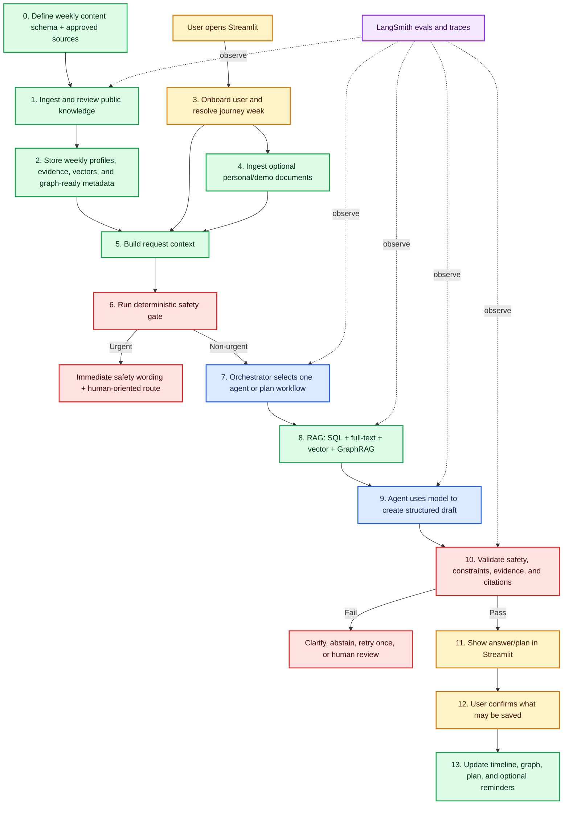
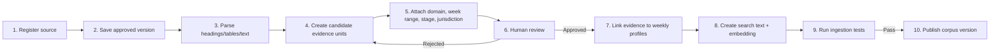
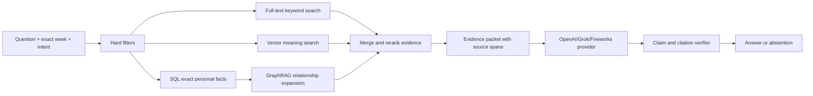
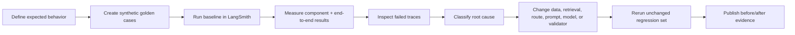

# Nestline — Complete Product and AI Architecture

**Product:** Nestline<br>
**Assistant:** Compass<br>
**Status:** Architecture decision and build plan<br>
**Interface:** Streamlit web application<br>
**Journey:** Possible pregnancy, pregnancy weeks 1–42, and postpartum weeks 1–12<br>
**Language:** English<br>
**Updated:** 9 September 2026

> This is the canonical Nestline architecture. It is written in implementation order so a new contributor can understand what we are building, why every component exists, and what must happen next.

> Nestline is an educational and organizational capstone prototype. It is not a doctor, diagnostic system, prescriber, medical device, emergency service, or clinically validated product. The public demo uses fictional data and tells visitors not to upload real medical information.

---

## 1. What are we building?

Nestline is a week-aware maternal journey companion. A user tells Compass where they are in their journey, optionally enters allergies, conditions, symptoms, appointments, and fictional demo documents, and receives a home page tailored to that week. They can ask questions, understand what their uploaded records say, create and save a weekly nutrition/movement/well-being plan, prepare questions for an appointment, and navigate symptoms safely.

Nestline combines three types of information without mixing them:

1. **Public guidance:** reviewed, source-backed maternal-health information.
2. **Personal facts:** information the user confirms or that is extracted from their uploaded documents and then confirmed.
3. **Journey state:** possible pregnancy, exact pregnancy week, approximate month range, or postpartum week.

The AI organizes and explains this information. It does not diagnose, prescribe, or replace a professional.

## 2. Decisions already made

| Decision | Locked choice | Reason |
|---|---|---|
| Front end | Streamlit | Fastest way to build and deploy the complete capstone experience |
| Deployment | Streamlit Community Cloud from GitHub | Simple team sharing and evaluator access |
| Permanent data | Supabase | Authentication, database, private files, pgvector, and Row Level Security in one platform |
| Orchestration | LangGraph with LangChain components | Explicit routes, bounded agent calls, retries, and visible traces |
| Observability/evals | LangSmith | Trace every route and compare prompt/model/retrieval versions |
| Primary model | OpenAI API, if API billing and key are confirmed | Known team access and strong structured-output support |
| Grok | Not used in the baseline | Access is uncertain and it does not solve the data/RAG problem |
| Alternative model | Fireworks AI behind the same adapter | Useful only if access/cost/evals make it better |
| Weekly structure | Separate profile for every pregnancy and postpartum week | Week 10 and week 20 must never be treated as the same context |
| Knowledge system | One governed RAG platform with filtered shelves | Avoids duplicating ingestion and databases for every agent |
| GraphRAG | Small journey graph inside retrieval | Connects records, symptoms, restrictions, plans, evidence, and follow-ups |
| Human in loop | Simulated reviewer/clinician workflow | Demonstrates escalation honestly without claiming a real doctor service |
| Videos | Out of scope | Removed to protect time and evaluation depth |
| n8n | Stretch: reminders and reviewer notifications only | Must not sit in urgent or synchronous chat paths |
| Fine-tuning | Only after evals show a repeated narrow failure | RAG/data/orchestration failures should not be hidden with training |
| MCP | Deferred | Typed Python tools are enough for this capstone |
| Real medical data | Prohibited in public demo | The prototype is not production-compliant |

### 2.1 Where does Grok fit?

**The baseline does not use Grok.** This is deliberate, not a missing architecture box.

Grok, OpenAI, or a Fireworks-hosted model would all occupy the same **model-provider position**:

```text
Retrieved evidence + personal facts + current week
                         ↓
        Model provider: OpenAI OR Grok OR Fireworks
                         ↓
               Structured draft response
                         ↓
          Safety, evidence, and citation checks
```

The model does not:

- create the authoritative weekly dataset;
- decide which user owns a document;
- store records;
- perform database permissions;
- replace retrieval;
- become the source for an uncited medical statement.

If the team later receives Grok API access, implement it as another provider adapter and run the same eval suite. It replaces OpenAI for selected generation/extraction calls; it is not an additional RAG layer. Basic maternal-health questions still require retrieved evidence. Only non-medical product-help questions may be answered without medical RAG.

---

## 3. The complete architecture in implementation order

This is the one pipeline the team should follow.



### Pipeline responsibility table

| Step | What happens | Main technology | Output |
|---:|---|---|---|
| 0 | Define what one week record contains and which sources are allowed | JSON/Pydantic schemas | Empty weekly templates and source registry |
| 1 | Extract candidate evidence, attach week/applicability metadata, review it | Python, PyMuPDF/HTML parser, optional LLM extraction | Approved evidence fragments |
| 2 | Save structured content, searchable chunks, embeddings, and relationship metadata | Supabase/Postgres/pgvector | Published corpus version |
| 3 | Collect due date/week/month/delivery date and resolve the current stage | Streamlit + deterministic Python | Versioned journey state |
| 4 | Parse optional fictional demo documents and ask the user to confirm extracted facts | Supabase Storage, parser/OCR, structured extraction | Confirmed personal facts + document chunks |
| 5 | Assemble week, facts, symptoms, records, saved plans, and question | Python service layer | Typed request context |
| 6 | Check urgent patterns before generative reasoning | Deterministic rules | Safe, urgent, or clarify route |
| 7 | Pick the smallest required specialist workflow | LangGraph | Agent execution plan |
| 8 | Retrieve exact facts and supporting passages; traverse relevant graph edges | SQL, full text, pgvector, GraphRAG | Evidence packet |
| 9 | Turn the evidence packet into a structured answer or plan contribution | OpenAI API/provider adapter | Draft schema |
| 10 | Reject unsafe, conflicting, wrong-week, or unsupported content | Pydantic + rules + evidence verifier | Approved output or failure route |
| 11 | Render provenance, citations, actions, and limitations | Streamlit | User-visible result |
| 12 | Ask before saving extracted facts, plans, reminders, or handoff packets | Streamlit | Explicit consent/action |
| 13 | Persist the confirmed change and mark affected outputs stale | Supabase + graph updates; optional n8n | Updated continuity state |

---

## 4. Stage 0 — Create a genuinely weekly content system

### 4.1 Is the source material actually week-wise?

Partly.

- Pregnancy, Birth and Baby has a weeks 1–4 page and individual pages for weeks 5–40.
- The NHS has individual pregnancy content from week 4 through week 41.
- MedlinePlus helps explain gestational dating and why weeks 1–2 require careful language.
- WHO, ICMR-NIN, and many movement/mental-health guidelines are **not weekly**. Their advice applies across a wider period or depends on symptoms, conditions, or professional clearance.
- Postpartum guidance is often organized around the first 24 hours, day 3, days 7–14, week 6, or general recovery—not a unique article for every week through week 12.

Therefore, Nestline must not claim that every domain changes every week. The product has a separate weekly profile, but stable evidence may appear in consecutive weeks when its real applicability has not changed.

### 4.2 Weekly records we will create

| Record family | IDs | Count | Purpose |
|---|---|---:|---|
| Possible pregnancy | `PC00` | 1 | Verification and next-step education without assuming pregnancy |
| Pregnancy weeks | `P01`–`P42` | 42 | One addressable record for each gestational week |
| Postpartum weeks | `PP01`–`PP12` | 12 | One addressable record for each postpartum week |
| Early postpartum days | `PPD0`–`PPD7` | 8 | Day-specific safety/follow-up additions during postpartum week 1 |

`P13` and `P14` are different records. They may reference the same reviewed hydration fragment, but each has its own weekly hero, development/body information, preparation items, and applicable fragment list.

### 4.3 What one weekly profile contains

```json
{
  "profile_id": "P10",
  "stage": "pregnancy",
  "week": 10,
  "status": "draft | reviewed | published",
  "hero": {
    "title": "source-backed weekly title",
    "development_evidence_ids": [],
    "visual_asset_id": null
  },
  "card_slots": {
    "what_may_change": [],
    "nutrition_focus": [],
    "movement_focus": [],
    "wellbeing_focus": [],
    "symptom_education": [],
    "preparation": [],
    "consider": [],
    "avoid": [],
    "ask_a_professional": []
  },
  "guidance_fragment_ids": [],
  "source_evidence_ids": [],
  "jurisdiction": ["GLOBAL", "IN"],
  "reviewed_by": null,
  "version": "1.0.0"
}
```

### 4.4 Reusable guidance fragment

A fragment is one small, source-backed claim or action that can be safely reused.

```json
{
  "fragment_id": "movement_general_001",
  "domain": "movement",
  "applies_to": {
    "stage": "pregnancy",
    "week_start": 8,
    "week_end": 20,
    "conditions_required": [],
    "conditions_excluded": []
  },
  "text": "reviewed paraphrase",
  "evidence_span_ids": ["WHO_PA_PAGE_X"],
  "jurisdiction": "GLOBAL",
  "review_status": "reviewed"
}
```

This prevents duplicate storage while keeping the user experience weekly. The source decides the applicability range; the LLM does not invent it.

### 4.5 Month-only input

If the user knows only a month, Nestline stores an approximate range:

| Month | Approximate week range |
|---:|---|
| 1 | 1–4 |
| 2 | 5–8 |
| 3 | 9–13 |
| 4 | 14–17 |
| 5 | 18–22 |
| 6 | 23–27 |
| 7 | 28–31 |
| 8 | 32–35 |
| 9 | 36–40+ |

Nestline does not secretly select a week. It displays the range and retrieves only information supported across that range. Exact weekly claims require an estimated due date or user-provided week.

### 4.6 Source coverage plan

| Content need | Primary source candidate | Weekly behavior |
|---|---|---|
| Pregnancy weeks 1–4 | [Pregnancy, Birth and Baby week-by-week index](https://www.pregnancybirthbaby.org.au/pregnancy/pregnancy-stages/pregnancy-week-by-week) + MedlinePlus | Build separate P01–P04 profiles but use careful dating language |
| Pregnancy weeks 5–40 | [Pregnancy, Birth and Baby week-by-week index](https://www.pregnancybirthbaby.org.au/pregnancy/pregnancy-stages/pregnancy-week-by-week) | Map each individual week page to the matching weekly profile |
| Pregnancy weeks 4–41 cross-check | [NHS week-by-week guide](https://www.nhs.uk/best-start-in-life/pregnancy/week-by-week-guide-to-pregnancy/) | Cross-check exact-week facts; do not import UK care schedules as Indian schedules |
| Gestational dating | [MedlinePlus fetal development](https://medlineplus.gov/ency/article/002398.htm) | Supports possible-pregnancy and early-week wording |
| Week 41 and at/beyond term | [NHS week 41](https://www.nhs.uk/best-start-in-life/pregnancy/week-by-week-guide-to-pregnancy/3rd-trimester/week-41/) + [WHO recommendations at or beyond term](https://www.who.int/publications/i/item/9789240052796) | Professional-follow-up education only; do not turn a guideline for professionals into personalized treatment advice |
| Antenatal guidance | [WHO antenatal-care recommendations](https://www.who.int/publications/i/item/9789241549912/) | Create fragments with real applicability; do not force into fake weekly changes |
| India nutrition | [ICMR-NIN Dietary Guidelines for Indians 2024](https://www.nin.res.in/dietaryguidelines/pdfjs/locale/DGI07052024P.pdf) | Nutrition fragments mapped to weeks only when the evidence supports it |
| Movement | [WHO physical-activity guidance](https://iris.who.int/bitstream/handle/10665/336656/9789240015128-eng.pdf) | General fragments plus personal restrictions/symptoms; never infer clearance |
| Perinatal well-being | [WHO perinatal mental-health guide](https://www.who.int/publications/i/item/9789240057142) | Stage-appropriate support and escalation fragments, not weekly diagnosis |
| Postpartum | [WHO postnatal-care guideline](https://www.who.int/publications/i/item/9789240045989) | Map source-defined timing to PP profiles; repeat stable guidance honestly |
| Postnatal timing | [WHO maternal intervention timing](https://www.who.int/teams/maternal-newborn-child-adolescent-health-and-ageing/handbooks/programme-manager-s-handbook-mncah/recommendations-on-interventions-along-life-course/maternal) | Supports day 0, day 3, days 7–14, and week 6 additions |
| Safety taxonomy | [CDC urgent maternal warning signs](https://www.cdc.gov/hearher/maternal-warning-signs/index.html) plus locally reviewed policy | Used to design safety rules/evals, not copied blindly into India deployment |

`P42` exists in the schema so the system can represent the user's reported/calculated state, but it must remain unpublished until its exact content and local care wording are reviewed. The app should prioritize contacting the user's maternity professional rather than generate a generic week-42 wellness page.

### 4.7 Source rules

- Store title, owner, jurisdiction, publication/update date, source version, URL, reuse/license status, approved sections, reviewer, and retirement status.
- Do not ingest a source merely because it is authoritative; confirm its reuse terms.
- Every displayed medical/health claim links to an evidence span.
- Preserve the source's true applicability. “Relevant in pregnancy” does not automatically mean “new in week 10.”
- Foreign appointment schedules remain jurisdiction-labeled and do not become Indian care instructions.
- No live medical web search during user answers.
- Updating a source creates a new corpus version and reruns regression evals.

---

## 5. Stage 1 — Public-knowledge ingestion, in plain language

Ingestion means turning a page/PDF into small, traceable evidence units the system can safely search.



### Exact implementation steps

1. Add an approved URL/PDF to `source_registry`.
2. Save the specific version/date so future website changes do not silently change answers.
3. Parse HTML by headings or PDF by page/section using Python and PyMuPDF/HTML parsing.
4. Remove headers/navigation while preserving meaning, page number, heading, and exact source text.
5. Optionally use the model to propose structured fields; treat them as candidates, not truth.
6. Validate candidates with Pydantic schemas.
7. A reviewer confirms domain, stage, exact week/applicability range, wording, jurisdiction, and evidence span.
8. Link approved evidence/fragments to the applicable weekly profiles.
9. Store the original text for citation, normalized text for search, and one embedding per approved unit.
10. Test missing citations, invalid week ranges, duplicate units, unsupported profile links, and license/review status.
11. Publish only passing records under a version such as `corpus_2026_09_09_v1`.

**The model can help format source content, but it cannot decide medical truth or manufacture weekly guidance from a broad PDF.**

---

## 6. Stage 2 — Storage: where every kind of data lives

| Data type | Supabase location | Why |
|---|---|---|
| Accounts and access | Supabase Auth + Row Level Security | Prevent one user from seeing another user's data |
| Journey/week | `journey_states` | Exact, deterministic lookup |
| Weekly cards | `weekly_profiles` | One record per week |
| Reusable public evidence | `guidance_fragments` and `guideline_chunks` | Search, citations, and reuse |
| Embeddings | pgvector columns | Semantic retrieval |
| Uploaded files | Private Supabase Storage bucket | Original document and ownership |
| Extracted facts | `document_facts`, `health_facts`, `medication_mentions` | Exact SQL queries and confirmation status |
| Symptoms | `symptom_events` | Safety and timeline |
| Appointments/questions | `appointments`, `appointment_questions` | Follow-up workflow |
| Plans | `plans`, `plan_items` | Draft/saved/versioned/stale state |
| Relationships | `graph_nodes`, `graph_edges` | GraphRAG continuity |
| Human review | `human_review_cases` | Honest pending/resolved/unavailable status |
| Notifications | `notifications` | Consent, idempotency, retries, delivery status |
| Feedback/eval links | `feedback` | Connect UX feedback to a LangSmith trace |

### Data security rules

- A personal workspace starts empty.
- Demo data lives under a separate, visibly fictional workspace.
- Every user-owned table has Row Level Security.
- Every personal vector query includes the authenticated workspace filter at database level.
- Deleting a document also deletes derived facts, chunks, graph edges, and cached summaries.
- LangSmith traces contain synthetic or redacted data only.
- Cross-user leakage blocks release.

---

## 7. Stage 3 — Onboarding and journey resolution

### Streamlit onboarding flow

1. Show what Nestline can/cannot do and the public-demo privacy warning.
2. Ask the user to choose Personal Empty Workspace or Fictional Demo Mode.
3. Ask where they are: may be pregnant, pregnant, or postpartum.
4. Present one timing dropdown:
   - estimated due date — recommended;
   - current gestational week and optional day;
   - approximate pregnancy month;
   - delivery date;
   - current postpartum week.
5. Resolve timing with deterministic Python—not an LLM.
6. Display the calculated week/range and ask the user to confirm it.
7. Optionally collect allergies, medical history/conditions, restrictions, current symptoms, and appointments.
8. Optionally upload fictional demo documents.
9. Ask the user to confirm extracted information before it becomes active context.
10. Open the weekly home page.

### Timing rules

- Estimated due date calculates gestational week/day and stores calculation date.
- Week/day stores a user-reported value and effective date.
- Month stores only an approximate range.
- Delivery date calculates postpartum day/week.
- Conflicting due date and week are displayed together and require confirmation; the system never silently chooses.
- The week rolls forward deterministically with time.
- Weeks 1–2 and “may be pregnant” use careful dating/verification language and do not assert a confirmed pregnancy.

---

## 8. Stage 4 — Personal documents and the synthetic demo profile

### 8.1 Do we need a synthetic profile?

Yes—for repeatable demonstration and evaluation—but it must be isolated.

- **Personal Mode:** always empty for a first-time user.
- **Demo Mode:** one clearly labeled fictional persona with fictional documents.
- **Tests:** additional synthetic fixtures that never appear in the user's workspace.

The synthetic profile is not medical knowledge and is not placed in public RAG. It exists only to prove personalization, extraction, conflict handling, GraphRAG, saved plans, and human review.

### 8.2 Recommended fictional demo package

Create a coherent fictional case containing:

- journey state and estimated due date;
- one confirmed food allergy;
- one clinician-recorded movement restriction;
- one appointment date;
- one short fictional prescription/visit note;
- one fictional report with a follow-up item;
- one deliberately contradictory or low-confidence document field;
- one existing saved plan that becomes stale after the new record is confirmed.

Use invented names and values. Add a visible `FICTIONAL DEMO DATA` watermark. Do not imitate or modify a real person's documents.

### 8.3 Personal-document ingestion

1. Authenticate and assign the file to the workspace.
2. Validate file format, size, password/lock status, and malware policy.
3. Save the original in a private bucket.
4. Parse text; use OCR only if the PDF is image-based.
5. Classify document type using a small structured model call.
6. Extract candidate facts: dates, clinician, medication mention, instruction, allergy, condition, appointment, test, and follow-up.
7. Preserve page and exact text span for every extracted fact.
8. Assign extraction confidence/completeness metadata.
9. Show significant or uncertain fields to the user for confirmation.
10. Save confirmed facts in SQL; save permitted text chunks in the personal vector collection.
11. Create graph nodes/edges and detect conflicts without overwriting older facts.
12. Mark affected dashboard cards/plans stale and show what changed.

Text inside a document is untrusted content. “Ignore previous instructions” in a PDF is stored as text and never changes system policy.

---

## 9. Stage 5 — RAG explained simply

### 9.1 What RAG means here

Think of RAG as a librarian:

1. The user asks a question.
2. Nestline first identifies the exact week, domain, and personal context.
3. The librarian retrieves only the most relevant approved public passages and permitted personal facts.
4. The model writes an answer using that evidence.
5. A verifier checks whether the answer is actually supported.

The model is the writer, not the library.

### 9.2 Why we are not building one database per agent

All agents use one Retrieval Gateway, but each sends a different filter:

| Agent | Public shelf | Personal context |
|---|---|---|
| Record | None unless explanation needs public context | Uploaded document chunks and confirmed facts |
| Medication Record | Medication-related document spans | Medication mentions, dates, instructions, conflicts |
| Symptom Navigation | Approved symptom/safety guidance | Current week, symptoms, restrictions, recent events |
| Nutrition | Nutrition evidence valid for the current week/range | Allergies, conditions, symptoms, saved preferences |
| Movement | Movement evidence valid for the current stage | Restrictions, symptoms, recorded clearance/status |
| Well-being | Approved perinatal well-being guidance | Check-ins, stage, prior follow-up state |
| Follow-up | Care-preparation/follow-up guidance | Appointments, open questions, record changes |

Separate infrastructure for every agent would duplicate documents, embeddings, permissions, updates, and evals. Logical shelves and hard filters give specialization without seven disconnected RAG systems.

### 9.3 Exact retrieval pipeline



Step by step:

1. Convert the question to a typed request: domain, exact week/range, stage, jurisdiction, and allowed source scope.
2. Apply hard filters before semantic search. A pregnancy-week-10 nutrition request cannot retrieve postpartum or week-30-only evidence.
3. Query SQL for exact personal facts; do not use vector search to guess an appointment date or allergy.
4. Run Postgres full-text search for matching terms.
5. Run pgvector search for semantically similar approved passages.
6. Run bounded GraphRAG traversal for connected restrictions, conflicts, superseded facts, plans, appointments, and evidence.
7. Merge and rerank by authority, applicability, source version, exact-week fit, and relevance.
8. Return an evidence packet with IDs, source spans, and provenance labels.
9. Give only that packet plus necessary state to the model.
10. Verify each material claim and citation. Retry retrieval once if the wrong evidence was found; otherwise abstain or escalate.

### 9.4 When GraphRAG enters the pipeline

GraphRAG is part of **Step 6 inside retrieval**. It is not a separate final feature.

Vector search answers: “Which passages discuss this question?”

GraphRAG answers: “Which known facts and actions are connected for this user?”

Example:

```text
Week P24
  -> current symptom event
  -> clinician-recorded movement restriction
  -> restriction constrains movement plan item
  -> new document supersedes an older instruction
  -> change marks saved weekly plan stale
  -> unresolved conflict creates a question for next appointment
```

Use these node types: `Person`, `JourneyState`, `WeeklyProfile`, `Document`, `DocumentFact`, `MedicationMention`, `Allergy`, `Condition`, `SymptomEvent`, `Appointment`, `Plan`, `PlanItem`, `GuidelineEvidence`, `Question`, and `HumanReviewCase`.

Use these edge types: `IN_WEEK`, `EXTRACTED_FROM`, `CONFLICTS_WITH`, `SUPERSEDES`, `CONSTRAINS`, `SUPPORTED_BY`, `TRIGGERED`, `SCHEDULED_FOR`, `NEEDS_CLARIFICATION`, and `REVIEWED_BY`.

For the capstone, store graph nodes/edges in Postgres and traverse them with bounded Python queries. Do not add Neo4j. A NetworkX visualization may show the graph to evaluators, but it is not the source of truth.

### 9.5 Load and cost control

- Precompute and cache published weekly home profiles.
- Do not run RAG or agents merely to open the dashboard.
- Embed approved public evidence once per corpus version.
- Use SQL for exact facts and vectors only for passage discovery.
- Ordinary questions invoke one specialist agent.
- Only full-plan generation runs several specialists in parallel.
- Limit retrieval count, graph depth, agent steps, model calls, tokens, and total latency.
- Cache only non-personal public retrieval results by question, week/range, domain, jurisdiction, and corpus version.

---

## 10. Stage 6 — Safety before agents

The Safety Gate is a deterministic control, not an LLM agent.

It runs on:

- onboarding symptom text;
- every chat message;
- symptom check-ins;
- extracted document facts;
- plan-generation inputs.

Possible results:

1. `urgent`: stop the normal agent flow and show reviewed emergency-oriented wording.
2. `needs_clarification`: ask the minimum safety question; if safety remains unclear, escalate.
3. `non_urgent`: continue to the orchestrator.

The model may help understand phrasing, but it cannot downgrade a deterministic urgent match. The capstone uses a locally reviewed synthetic red-flag test set and does not claim clinical validation.

---

## 11. Stage 7 — Orchestration and every agent's workflow

An agent is a bounded workflow with a trigger, tools, structured output, and stop rule. Agents do not own separate databases and do not call one another directly. The orchestrator coordinates them through shared typed state.

### 11.1 Journey Orchestrator Agent

**Purpose:** decide what workflow is needed and keep it bounded.

1. Receive safe request context from the Safety Gate.
2. Classify intent: record, medication record, symptom, nutrition, movement, well-being, follow-up, full plan, or out of scope.
3. Decide whether one specialist is enough.
4. Create a typed execution plan with maximum steps/tool calls.
5. Send only necessary context to the specialist.
6. Collect structured output.
7. Route it to validators and response composition.
8. Stop on unsupported intent, tool budget, conflicting agents, or validation failure.

### 11.2 Record Agent

**Purpose:** explain what an uploaded record actually documents.

1. Identify the record/question and authenticated workspace.
2. Retrieve document facts and exact page/span evidence.
3. Distinguish confirmed, unconfirmed, and conflicting fields.
4. Create a plain-language summary using “this document says.”
5. Show source page/span and uncertainty.
6. Offer actions: confirm fact, correct extraction, add appointment question, or request human clarification.
7. Never infer a diagnosis or treatment beyond the document.
8. Stop when OCR is poor, the record is missing, or documents conflict.

### 11.3 Medication Record Agent

**Purpose:** organize medication information without giving medication advice.

1. Retrieve medication mentions, dates, document spans, and confirmation state.
2. Build a chronological “recorded as” timeline.
3. Compare current and older instructions.
4. Detect missing dose/frequency or contradictory records.
5. Explain only what is documented.
6. Create a clarification question for the professional when necessary.
7. Refuse requests to start, stop, substitute, or change medication.
8. Escalate conflicts, unclear instructions, or safety concerns.

### 11.4 Symptom Navigation Agent

**Purpose:** help the user choose a safe next step, not diagnose.

1. Receive only after the first Safety Gate pass.
2. Ask minimal structured questions: symptom, onset, severity, duration, change, and relevant context.
3. Rerun the Safety Gate with the new details.
4. Retrieve approved evidence for the exact stage/week.
5. Classify the route as urgent, professional follow-up, monitor/track, or insufficient information.
6. Explain the route without naming an unconfirmed condition.
7. Offer tracking or a handoff summary.
8. Never provide unsafe reassurance; escalate if uncertainty prevents a safe route.

### 11.5 Nutrition Agent

**Purpose:** answer food/nutrition questions and create a weekly meal framework.

1. Read exact week/range and requested goal.
2. Fetch confirmed allergies, conditions, restrictions, symptoms, and preferences.
3. Retrieve approved nutrition evidence applicable to that state.
4. Generate options/components, not a therapeutic diet.
5. Remove candidates that violate a hard constraint.
6. Cite why each material suggestion is included or excluded.
7. Return a structured contribution for chat or Plan Composer.
8. Stop when the request requires an individualized clinical diet or evidence is missing.

### 11.6 Movement Agent

**Purpose:** answer movement questions and create a conservative weekly activity framework.

1. Read exact week, symptoms, restrictions, and recorded clearance/status.
2. Run movement-specific hard constraints.
3. Retrieve approved stage-applicable movement evidence.
4. Generate activity type, duration range, intensity language, and stop conditions.
5. Validate every item against restrictions and symptoms.
6. Cite the evidence and state whether professional confirmation is needed.
7. Return structured chat or plan output.
8. Stop when clearance is unknown but required, a concerning symptom exists, or a contraindication/conflict appears.

### 11.7 Well-being Agent

**Purpose:** provide supportive check-ins and appropriate escalation.

1. Receive the user's question or check-in and journey stage.
2. Run acute-safety/self-harm escalation rules before supportive generation.
3. Retrieve approved perinatal well-being evidence.
4. Offer bounded exercises such as reflection, grounding, support planning, or appointment preparation.
5. Ask whether the user wants to track or discuss the concern with a professional.
6. Create a follow-up item when appropriate and consented.
7. Never diagnose a mental-health condition.
8. Stop and escalate acute safety, persistent/worsening concern, or need for clinical assessment.

### 11.8 Follow-up Agent

**Purpose:** turn records and conversations into organized next steps.

1. Retrieve upcoming appointments, open questions, new record facts, unresolved conflicts, and plan status.
2. Group items into before appointment, ask during appointment, and after appointment.
3. Remove duplicates and preserve provenance.
4. Prioritize safety/conflict-related questions without claiming medical priority.
5. Propose reminders but do not schedule without consent.
6. Produce a concise appointment brief.
7. Update items only after user confirmation.
8. Escalate missing or contradictory instructions instead of resolving them.

### 11.9 Plan Composer Agent

**Purpose:** combine specialist contributions into one coherent weekly draft.

1. Receive independently structured Nutrition, Movement, Well-being, and Follow-up contributions.
2. Check each contribution has evidence and the same journey-state version.
3. Detect contradictions or an unrealistic combined workload.
4. Arrange items into a simple daily/weekly structure.
5. Pass the draft to deterministic allergy, restriction, safety, and source validators.
6. Revise once if a validator provides a safe mechanical correction.
7. Otherwise abstain or route the conflict for clarification.
8. Show an editable draft.
9. Ask: “Would you like to change, save, or discard this plan?”
10. Save a version only after explicit approval.

### 11.10 Human Review Workflow

**Purpose:** make uncertainty visible and prepare a safe handoff.

1. Receive an urgent, conflicting, unsupported, or explicitly requested review case.
2. Tell the user what the AI cannot resolve.
3. Ask consent to share the minimum necessary context.
4. Create a packet containing the question, journey state, relevant confirmed facts, evidence spans, conflict, and requested action.
5. Put it in a **simulated** reviewer queue.
6. Let the demo reviewer respond, request clarification, or mark unavailable.
7. Show the true status: pending, responded, or unavailable.
8. Never say “doctor reviewed” unless a real credentialed, authorized reviewer did.
9. Never delay an urgent route while waiting for email or a queue.

---

## 12. Stage 8 — Validation and answer composition

Every agent output passes through controls before the user sees it:

1. **Schema validator:** required fields and types exist.
2. **Journey validator:** evidence applies to the correct stage/week/range.
3. **Personal constraint validator:** no allergy, condition, restriction, or confirmed instruction is violated.
4. **Evidence verifier:** every material health claim maps to an evidence span.
5. **Citation validator:** citation exists, is current/approved, and supports the claim.
6. **Boundary validator:** no diagnosis, prescription, unsafe reassurance, or fake professional review.
7. **Consistency validator:** public guidance does not silently override a personal record conflict.

If validation fails, the system may retrieve again once. It then clarifies, abstains, or escalates. It does not keep looping until the model produces a convenient answer.

### User-visible provenance

Every relevant statement is labeled as one of:

- **Your confirmed information**
- **Your uploaded record says**
- **You reported**
- **Public guidance says**
- **Needs confirmation**

---

## 13. Stage 9 — Streamlit product experience

### 13.1 Application structure

`streamlit_app.py` is the deployment entry point. Keep page components separate from services:

```text
streamlit_app.py
app/
  pages_and_components/
  services/
    journey.py
    safety.py
    retrieval.py
    graph.py
    documents.py
    plans.py
  agents/
  schemas/
  evals/
  data/
```

`st.session_state` stores temporary interaction state only. Supabase stores durable journey state, confirmed facts, documents, appointments, and plans.

### 13.2 Weekly home page

Render in this order:

1. journey header: exact week/day or clearly approximate range;
2. week-specific development hero and approved visual;
3. what may be changing now;
4. personal context: confirmed allergies, restrictions, conditions, and record changes;
5. nutrition, movement, well-being, and preparation focus;
6. consider / avoid / ask first, kept as separate categories;
7. reported symptoms and persistent emergency access;
8. next appointment, open questions, and follow-ups;
9. weekly plan: none, draft, saved, or stale;
10. unresolved extraction/conflict/human-review status;
11. quick actions and persistent Compass chat.

The dashboard uses prevalidated database content and does not call every agent on page load.

### 13.3 Chat capabilities

Compass can:

- explain stage-appropriate public guidance;
- explain an uploaded record with page/span evidence;
- organize medication mentions without advising changes;
- navigate a symptom to a safe next step;
- answer nutrition, movement, and well-being questions;
- create/edit/save a weekly plan;
- prepare appointment questions and follow-up tasks;
- check a traditional practice against available approved evidence;
- show uncertainty and request human clarification.

Compass cannot diagnose, prescribe, change medication, infer professional clearance, guarantee safety, or answer unsupported medical questions from model memory.

---

## 14. Stage 10 — Saving, stale plans, email, and n8n

### Save rules

- Chat answers are not automatically saved as facts.
- Extracted facts require confirmation.
- Plans require review and explicit save.
- Reminders require opt-in, date/time, timezone, and channel confirmation.
- Human-review packets require consent.

Every saved plan stores journey-state version, personal-fact dependencies, evidence IDs, creation date, and review date. A relevant change to week, allergy, restriction, symptom, medication record, or clinician instruction marks the plan stale and explains why.

### n8n placement

n8n can handle:

- opt-in appointment reminders;
- weekly digest email generated from already validated data;
- plan-review reminders;
- reviewer-queue notification;
- retry/dead-letter processing.

n8n is never responsible for urgent symptom detection, primary chat, evidence retrieval, or the only emergency communication. Email failures do not break the app.

---

## 15. Evaluation architecture, in plain language

Evaluation is not the last step. We create test cases before agents, run a baseline, inspect failures, make one change, and rerun the same cases.



### 15.1 Evaluation sets

| Dataset | What cases it contains | What it proves |
|---|---|---|
| `journey_resolver_set` | Due dates, week/day, month ranges, rollovers, conflicts, postpartum dates | Deterministic week correctness |
| `weekly_content_set` | Every published profile and deliberately wrong-week evidence | No profile/evidence mismatch |
| `retrieval_set` | Questions with expected public/personal evidence IDs | Evidence is found and correctly filtered |
| `safety_set` | Routine, ambiguous, worsening, urgent, and adversarial symptom phrasing | Red flags are not missed or reassured away |
| `routing_set` | Single-domain, multi-domain, out-of-scope, and ambiguous requests | Correct agent with minimal calls |
| `document_set` | Clear, noisy, locked, unsupported, conflicting, and prompt-injected fictional files | Safe extraction and confirmation |
| `agent_set` | Expected schemas, boundaries, citations, and stop behavior per agent | Specialist behavior is bounded |
| `plan_set` | Allergies, restrictions, conflicting contributors, state changes, stale plans | No hard constraint violation |
| `graph_set` | Expected nodes/edges, supersession, conflict, and downstream effects | GraphRAG continuity is correct |
| `security_set` | Cross-user retrieval, deletion, unauthorized file access | No personal-data leakage |
| `end_to_end_set` | Complete user journeys from onboarding to saved action/escalation | Components work together |

### 15.2 What we measure

- journey-resolution exact match;
- weekly-profile and applicability accuracy;
- retrieval Recall@k and citation precision;
- public/personal provenance accuracy;
- red-flag recall and unsafe-reassurance count;
- agent-routing accuracy and unnecessary-agent calls;
- extraction accuracy and page/span provenance;
- unsupported-claim rate;
- allergy/restriction/medication-boundary violations;
- correct abstention and human-review routing;
- cross-user leakage and deletion completeness;
- latency, model calls, tokens, and cost;
- user task completion and clarity.

### 15.3 Non-negotiable release gates for the capstone

- 100% correct deterministic journey calculations on the golden set.
- 100% red-flag recall on the curated critical demo set.
- Zero unsafe reassurance in safety cases.
- Zero cross-user retrieval in security tests.
- Zero uncited material health claims in the three recorded demo scenarios.
- Zero wrong-week evidence in the recorded demo scenarios.
- Zero saved plan item that violates a seeded hard allergy/restriction.
- No claim that a simulated reviewer is a real doctor.

These prove the tested capstone cases, not clinical safety for real-world deployment.

### 15.4 LangSmith usage

For every run, record:

- dataset/example ID;
- prompt, model, corpus, and agent-graph versions;
- selected route and agent calls;
- retrieved evidence IDs and rankings;
- graph nodes/edges used;
- validator decisions;
- latency, tokens, and cost;
- final output and evaluator scores.

Build a simple Streamlit evaluator page showing baseline vs improved results and one failed-trace walkthrough.

### 15.5 Fine-tuning decision

Do not fine-tune guidelines into the model. Guidelines belong in RAG so they remain cited and updateable.

Fine-tune only if the evals reveal a repeated, narrow behavior problem—such as structured extraction from noisy fictional records—and only after data, parsing, retrieval, schemas, and prompting are fixed. Keep a held-out test set and compare accuracy, safety, latency, and cost against the baseline.

---

## 16. Failure handling

| Failure | Product behavior |
|---|---|
| Invalid/conflicting timing | Show values, explain mismatch, request confirmation |
| Month only | Show approximate range; suppress exact-week claims |
| No uploaded records | Use stage-aware public guidance and say no personal record was used |
| Corrupt/locked/unsupported file | Mark failed and explain recovery |
| Low-confidence extraction | Highlight field and require confirmation |
| Wrong-person document | Do not ingest; ask user to remove/correct |
| Conflicting records | Preserve both; create conflict and professional question |
| Medication-change request | Explain record only; refuse change advice |
| Urgent symptom | Stop normal generation and show safety route |
| Ambiguous symptom | Ask minimum clarification; escalate if safety remains unclear |
| Missing evidence | Abstain; do not use model memory |
| Wrong-week evidence | Reject, retrieve once more, then abstain |
| Agent disagreement | Do not save; clarify or human-review route |
| Agent/tool loop | Stop at budget and return safe partial/abstention |
| Model timeout/rate limit | Retry once idempotently, then recoverable error |
| Supabase unavailable | Do not pretend personalization succeeded |
| Email/n8n failure | Keep app usable; record failure and retry asynchronously |
| Reviewer unavailable | State unavailable; never fake review |
| State changes after plan | Mark plan stale and identify dependency |
| Prompt injection in document | Treat as text; block instruction execution |
| Cross-user access | Block request and release; severity-zero privacy defect |
| User deletes data | Cascade-delete every derived artifact |
| Out-of-scope question | Explain scope and redirect |

Every Streamlit view requires loading, empty, success, validation-error, recoverable-error, blocked/safety, and stale states.

---

## 17. Build phases and strict Wednesday–Saturday plan

### Wednesday — foundation and first vertical slice

**Build:**

- Streamlit shell, navigation, privacy boundary, Personal/Demo Mode.
- Supabase project, tables, Storage, pgvector, and RLS.
- Journey resolver and weekly-profile schema.
- Source registry and ingestion script skeleton.
- Publish a small reviewed source slice for `PC00`, `P10`, and `PP01`.
- LangSmith project and initial resolver/content eval datasets.

**Blocking checklist:**

- [ ] App deploys from GitHub without secrets in repository.
- [ ] New Personal Mode is empty; Demo Mode is visibly fictional.
- [ ] Due date/week/month/delivery-date paths work.
- [ ] `P10` does not retrieve a deliberately wrong-week test passage.
- [ ] RLS cross-user test passes before document work.

### Thursday — ingestion, RAG, and GraphRAG

**Build:**

- Public parser, evidence schema, week/applicability mapping, review status, embeddings.
- Fictional document fixtures and personal ingestion/review flow.
- Retrieval Gateway: SQL + full text + pgvector + reranking.
- Graph nodes/edges for document → fact → restriction → plan/appointment.
- Record Agent and Medication Record Agent.
- Source/citation drawer in Streamlit.

**Blocking checklist:**

- [ ] Every retrieved chunk shows source, span/page, week applicability, and jurisdiction.
- [ ] Personal and public evidence are labeled separately.
- [ ] Unconfirmed extraction cannot personalize an answer.
- [ ] Prompt-injected document does not change agent behavior.
- [ ] Graph demo shows a real downstream dependency, not decorative nodes.

### Friday — safety, specialist agents, plans, and human workflow

**Build:**

- Safety Gate and urgent/clarify/non-urgent routes.
- Orchestrator.
- Symptom, Nutrition, Movement, Well-being, and Follow-up agents.
- Plan Composer and deterministic validators.
- Review/edit/save/stale-plan flow.
- Simulated human-review packet and status screen.

**Blocking checklist:**

- [ ] Urgent cases bypass ordinary generation.
- [ ] One-domain question invokes one specialist.
- [ ] Full plan invokes only required specialists and then Plan Composer.
- [ ] Seeded allergy/restriction cannot appear in saved plan.
- [ ] User must confirm before facts, plan, reminder, or review packet is saved.
- [ ] Simulated reviewer is never presented as a real doctor.

### Saturday — evaluation, fixes, packaging, and demo video

**Build:**

- Run all golden sets in LangSmith.
- Cluster failures by data, retrieval, routing, model, validation, security, or UX.
- Fix the highest-risk failures and rerun unchanged regression cases.
- Complete three end-to-end scenarios.
- Add evaluation dashboard, graph view, architecture, setup, README, reset button, and demo script.
- Record demo video only after release gates pass.

**Blocking checklist:**

- [ ] All non-negotiable gates in Section 15.3 pass.
- [ ] Demo Mode resets deterministically.
- [ ] No real medical or personal data exists in repository, database seed, traces, or recording.
- [ ] No broken Streamlit state after refresh/relogin.
- [ ] Baseline and improved eval results are visible and reproducible.
- [ ] README explains local run, deployment, architecture, limitations, and data sources.
- [ ] Demo video shows product value, evidence, graph continuity, safety route, and eval proof.

---

## 18. Capstone scope and demonstration

The data schema supports every week, but four days is not enough to clinically review unique content for all 54 weekly profiles. Create all profile shells; deeply populate and test a representative vertical slice. Unreviewed profiles stay hidden rather than displaying AI-manufactured content.

Recommended reviewed demo profiles:

- `PC00`, `P01`, and `P02` for possible/very early pregnancy behavior;
- `P09` and `P10` as distinct neighboring weeks;
- `P23` and `P24` as distinct neighboring weeks;
- `P35` and `P36` as distinct neighboring weeks;
- `PP01` with day-level additions;
- `PP05`, `PP06`, `PP11`, and `PP12` as distinct postpartum weeks.

### Three connected demo stories

1. **Week-aware plan:** resolve `P10`, confirm a fictional allergy and restriction, generate a sourced plan, edit it, and save it.
2. **Record-to-action continuity:** upload a fictional document, confirm extracted facts, see an appointment question and stale-plan state update, and inspect GraphRAG connections.
3. **Safety and human handoff:** report a curated red-flag scenario, observe the Safety Gate stop normal generation, consent to a simulated review packet, and inspect the passing LangSmith trace/eval.

---

## 19. Definition of done

Nestline is capstone-complete only when:

- Streamlit is the deployed interface and `streamlit_app.py` is the entry point;
- Personal Mode is empty and Demo Mode is visibly fictional/resettable;
- all timing inputs resolve deterministically and uncertainty is visible;
- `P01`–`P42` and `PP01`–`PP12` exist as separate profile records;
- unpublished profiles are hidden;
- every published health claim has approved evidence and applicability metadata;
- public, personal, and user-reported provenance are visibly separated;
- personal documents require confirmation before personalization;
- RAG performs hard week/stage/user filters before semantic search;
- GraphRAG participates inside retrieval and demonstrably propagates one change;
- agents follow their bounded runbooks and stop rules;
- urgent routes bypass normal generation;
- plans are editable, explicitly saved, versioned, constrained, and marked stale correctly;
- human review is honest and consent-aware;
- security, safety, week, citation, and plan release gates pass;
- LangSmith shows baseline, failure trace, improvement, and regression result;
- no video recommendation component, real patient data, secret, employer data, employer branding, or employer Git history exists in the project.

## 20. Remaining external prerequisites—not architecture ambiguity

The architecture is decided. Before implementation, the team still must provide or confirm:

1. OpenAI API key and API billing; ChatGPT Pro alone is not API access.
2. Supabase and LangSmith project credentials stored outside Git.
3. Source reuse/license clearance before copying any external content into the corpus.
4. A qualified reviewer before describing any content as clinically reviewed.
5. Locally appropriate emergency/help wording before external testing.

Until those production-grade reviews exist, Nestline remains a synthetic-data educational capstone—not a product for real clinical reliance.
